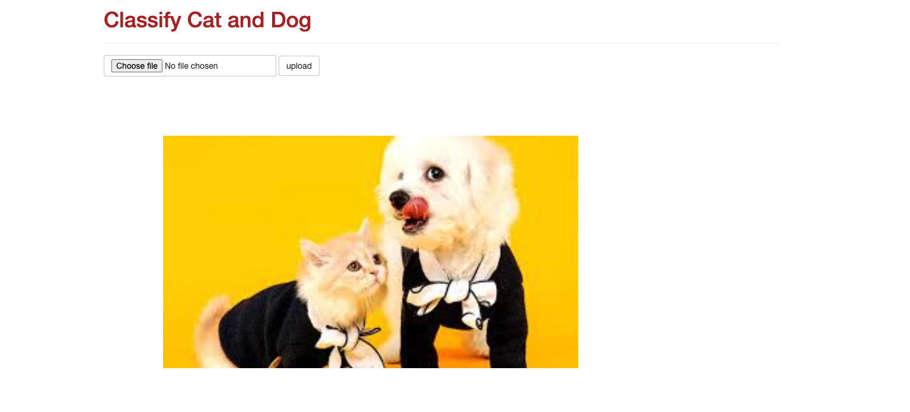

# Flask_tf_ImgClassify

### Intro
This is a simple web app to classify cat and dog

### Mechanism
- We serve a TensorFlow model with TensorFlow serving and Docker.
- We create a minimal flask application to create an interface to the served model.

### Demo
python run app.py

Main Page:
You can upload your own image here. The image will also be written to static file.

Result Page:
You can see the prediction result, telling you whether it's a dog or cat.
You can also see the predicted score.
Click back to main to go back.

